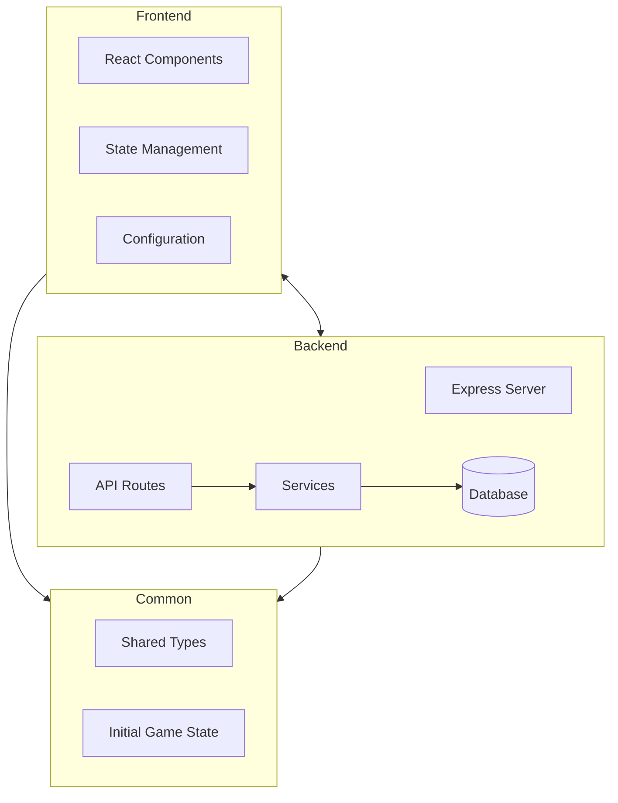
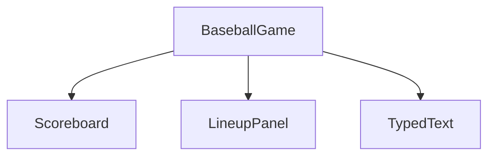

# Baseball Playback Application

A modern web application that simulates baseball games with AI-generated play-by-play commentary.

## Project Overview

The Baseball Playback application is designed to recreate baseball games with AI-generated commentary. It uses historical baseball data from the Retrosheet database to simulate games between different teams, with play-by-play narration generated using OpenAI's language models. The application features a responsive frontend that displays game information, team lineups, and a dynamic game log with typewriter-style text animation.

## Architecture Overview

The application follows a modern client-server architecture with three main components:



- **Frontend**: A React application built with TypeScript, responsible for rendering the UI and handling user interactions.
- **Backend**: An Express.js server that provides API endpoints for game initialization and play progression.
- **Common**: Shared types and data structures used by both frontend and backend.

## Frontend Structure

### Main Components

The frontend is built with React and TypeScript, using a component-based architecture:

- **BaseballGame**: The main container component that manages game state and coordinates other components.
- **Scoreboard**: Displays game information including inning, score, and current game situation.
- **LineupPanel**: Shows the lineups for both teams with the current batter highlighted.
- **TypedText**: A reusable component that displays text with a typewriter effect.

### Component Hierarchy



### State Management

The frontend uses React's useState and useEffect hooks for state management. The main state is stored in the BaseballGame component and includes:

- Game state (inning, outs, runners on base)
- Team information (lineups, current batter/pitcher)
- Game log entries

### API Integration

The frontend communicates with the backend through RESTful API calls:

- `GET /api/game/init/:gameId`: Initializes a game with the specified ID
- `GET /api/game/next/:gameId`: Retrieves the next play for the specified game

### Configuration

The frontend configuration is managed in `frontend/src/config/config.ts` and supports different environments (development, production, test). The configuration includes:

- API base URL
- API endpoints
- Environment-specific settings

## Backend Structure

### Server Setup

The backend is built with Express.js and TypeScript. The main entry point is `backend/src/bball-playback.ts`, which sets up the Express server with middleware and routes.

### API Routes

The backend provides the following API endpoints:

#### Game Routes (`backend/src/routes/game.ts`)

- `POST /api/game/createGame`: Creates a new game with specified home and visiting teams
- `GET /api/game/init/:gameId`: Initializes a game with the specified ID
- `GET /api/game/next/:gameId`: Retrieves the next play for the specified game
- `GET /api/game/info/:gid`: Retrieves game information from the plays table

### Services

#### OpenAI Integration (`backend/src/services/openai.ts`)

The backend integrates with OpenAI's API to generate play-by-play commentary. The service:

- Sends prompts to OpenAI's API
- Processes and formats the responses
- Logs completions to the database

#### Prompt Templates (`backend/src/services/promptTemplates.ts`)

The backend uses Handlebars templates to generate prompts for OpenAI:

- `initGameTemplate`: Template for initializing a game
- `nextPlayTemplate`: Template for generating the next play

### Database Schema

The application uses a MySQL database with the following tables:

#### OpenAI Completions Log

Stores information about OpenAI API calls:

```
openai_completions_log
- id (primary key)
- prompt
- model
- temperature
- max_tokens
- completion_id
- content
- finish_reason
- prompt_tokens
- completion_tokens
- total_tokens
- game_id
- latency_ms
- retry_count
- created_at
- openai_created_at
```

#### Umpires

Stores information about baseball umpires:

```
umpires
- id (primary key)
- lastname
- firstname
- first_g (first game date)
- last_g (last game date)
```

The database also includes tables from the Retrosheet database:
- `plays`: Contains play-by-play data for baseball games
- `gameinfo`: Contains metadata about baseball games
- `teams`: Contains information about baseball teams
- `ballparks`: Contains information about baseball stadiums

### Configuration

The backend configuration is managed in `backend/src/config/config.ts` and supports different environments (development, production, test). The configuration includes:

- Database connection details
- OpenAI API settings
- Server port

## Common Types and Shared Data

### Baseball Types (`common/types/BaseballTypes.ts`)

The application uses shared TypeScript interfaces to ensure type consistency between frontend and backend:

- `BaseballState`: The main state object that includes game state, home team, and visiting team
- `GameState`: Information about the current game situation
- `TeamState`: Information about a team, including lineup and stats
- `Player`: Information about a player, including position and name

### Initial Baseball State (`common/data/initialBaseballState.ts`)

The application includes a default initial state for new games, which includes:
- Default lineups for both teams
- Initial game state (inning 1, top half, 0 outs)
- Sample game log entries

## Development Workflow

### Running the Application

1. **Backend**:
   ```
   cd backend
   npm install
   npm run dev
   ```

2. **Frontend**:
   ```
   cd frontend
   npm install
   npm run dev
   ```

### Adding New Features

When adding new features to the application:

1. Define shared types in `common/types/BaseballTypes.ts` if needed
2. Implement backend functionality:
   - Add new routes in `backend/src/routes/`
   - Add new services in `backend/src/services/`
   - Add new database migrations if needed
3. Implement frontend functionality:
   - Add new components in `frontend/src/components/`
   - Update existing components as needed
   - Update configuration if needed

### Database Migrations

The application uses Knex.js for database migrations:

```
cd backend
npx knex migrate:latest
```

## Future Enhancements

Potential areas for future development:

1. Adding user authentication and game saving
2. Implementing more detailed statistics
3. Adding visual representation of the baseball field
4. Supporting historical games with real player data
5. Adding support for different commentary styles
