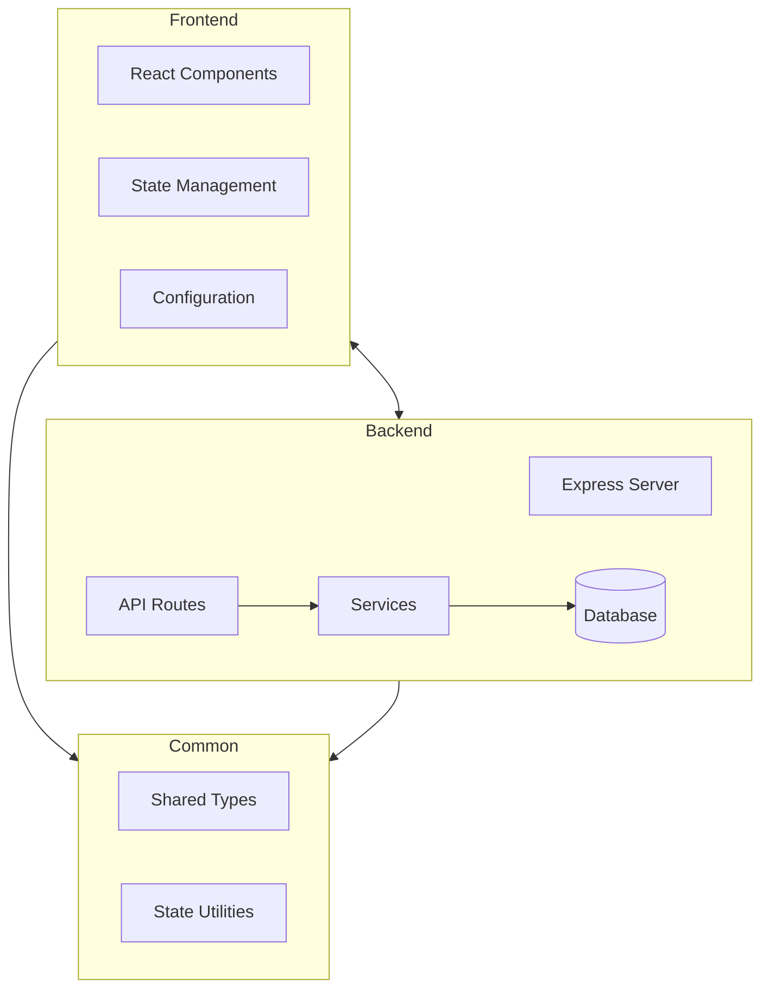
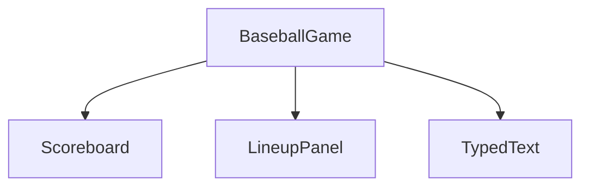
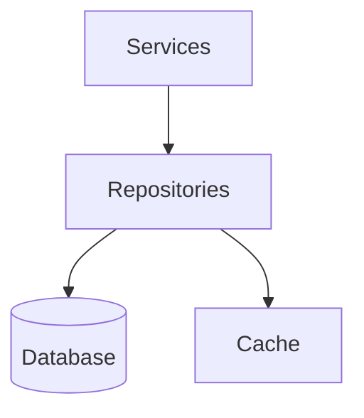
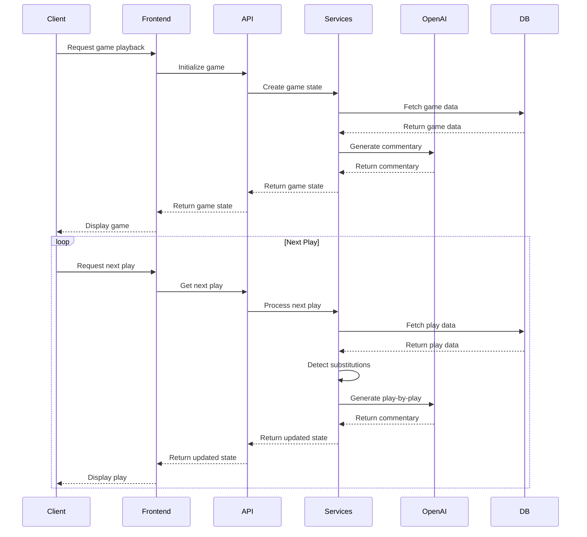

# Baseball Playback Application

A modern web application that simulates baseball games with AI-generated play-by-play commentary and detailed lineup tracking.


## Project Overview

The Baseball Playback application is designed to recreate baseball games with AI-generated commentary. It uses historical baseball data from the Retrosheet database to simulate games between different teams, with play-by-play narration generated using OpenAI's language models. The application features a responsive frontend that displays game information, team lineups, and a dynamic game log with typewriter-style text animation.

Key features include:
- AI-generated play-by-play commentary in multiple announcer styles
- Detailed lineup tracking with substitution detection
- Real-time scoreboard updates
- Comprehensive validation system for data integrity
- Optimized database queries with caching for improved performance

## Architecture Overview

The application follows a modern client-server architecture with three main components:



- **Frontend**: A React application built with TypeScript, responsible for rendering the UI and handling user interactions.
- **Backend**: An Express.js server that provides API endpoints for game initialization and play progression.
- **Common**: Shared types and data structures used by both frontend and backend.

## Frontend Structure

### Main Components

The frontend is built with React and TypeScript, using a component-based architecture:

- **BaseballGame**: The main container component that manages game state and coordinates other components.
- **Scoreboard**: Displays game information including inning, score, and current game situation.
- **LineupPanel**: Shows the lineups for both teams with the current batter highlighted.
- **TypedText**: A reusable component that displays text with a typewriter effect.

### Component Hierarchy



### State Management

The frontend uses React's useState and useEffect hooks for state management. The main state is stored in the BaseballGame component and includes:

- Game state (inning, outs, runners on base)
- Team information (lineups, current batter/pitcher)
- Game log entries

### API Integration

The frontend communicates with the backend through RESTful API calls:

- `GET /api/game/init/:gameId`: Initializes a game with the specified ID
- `GET /api/game/next/:gameId`: Retrieves the next play for the specified game

### Configuration

The frontend configuration is managed in `frontend/src/config/config.ts` and supports different environments (development, production, test). The configuration includes:

- API base URL
- API endpoints
- Environment-specific settings

## Backend Structure

### Server Setup

The backend is built with Express.js and TypeScript. The main entry point is `backend/src/bball-playback.ts`, which sets up the Express server with middleware and routes.

### Error Handling and Logging

The application implements a centralized error handling and logging system:

#### Error Handling (`backend/src/core/errors/`)

- **BaseError**: Base class for all application errors with additional properties like HTTP status code
- **ApiError**: API-specific error classes (BadRequestError, NotFoundError, etc.)
- **DomainError**: Domain-specific error classes (ValidationError, DatabaseError, etc.)
- **ErrorMiddleware**: Express middleware for consistent error handling
- **ErrorHandler**: Central utility for handling and processing errors

#### Logging (`backend/src/core/logging/`)

- **Logger**: Winston-based logger with different log levels (error, warn, info, http, debug)
- **HttpLogger**: Middleware for logging HTTP requests and responses
- **ContextLogger**: Utility for adding context to logs for better debugging

The system provides:
- Consistent error responses across the API
- Structured logging with different severity levels
- Context-rich logs for better debugging
- Process-level error handling for uncaught exceptions

### API Routes

The backend provides the following API endpoints:

#### Game Routes (`backend/src/routes/game/`)

- `POST /api/game/createGame`: Creates a new game with specified home and visiting teams
- `GET /api/game/init/:gameId`: Initializes a game with the specified ID
- `GET /api/game/next/:gameId?currentPlay=<playId>`: Retrieves the next play for the specified game after the current play ID
- `GET /api/game/info/:gid`: Retrieves game information from the plays table
- `GET /api/game/announceLineups/:gameId`: Announces the starting lineups for a game with AI-generated commentary

### Services

#### OpenAI Integration (`backend/src/services/openai.ts`)

The backend integrates with OpenAI's API to generate play-by-play commentary. The service:

- Sends prompts to OpenAI's API using either the chat completions or completions API based on the model
- Processes and formats the responses
- Logs completions to the database with detailed metrics
- Handles different model types (GPT-4, GPT-3.5-turbo, etc.)
- Measures and records latency for performance monitoring
- Supports retry logic for handling API failures

The OpenAI integration is configured with the following parameters:
- `model`: The OpenAI model to use (e.g., gpt-4, gpt-3.5-turbo)
- `maxTokens`: Maximum number of tokens to generate (default: 1000)
- `temperature`: Controls randomness in the output (default: 0.7)

#### Prompt Templates (`backend/src/services/prompts/`)

The backend uses Handlebars templates to generate prompts for OpenAI. Each prompt is organized in its own file:

- `initGame.ts`: Template and function for initializing a game
- `nextPlay.ts`: Template and function for generating the next play
- `lineupAnnouncement.ts`: Template and function for announcing lineups using the lineup data service
- `playByPlay.ts`: Template and function for generating customized play-by-play commentary with different announcer styles

#### Play-by-Play Commentary

The application supports generating play-by-play commentary in different announcer styles:

- **Classic** (Bob Costas): Professional, precise, knowledgeable, balanced
- **Modern** (Joe Buck): Energetic, concise, dramatic, modern
- **Enthusiastic** (Harry Caray): Enthusiastic, folksy, passionate, fan-like
- **Poetic** (Vin Scully): Eloquent, poetic, storytelling, detailed, conversational

To generate play-by-play commentary:

```typescript
import { generatePlayByPlayPrompt } from './services/prompts';
import { generateCompletion } from './services/openai';

// Get the baseball state from the next play endpoint
const baseballState = await fetchNextPlay(gameId, currentPlay);

// Generate the play-by-play prompt with a specific announcer style
const prompt = generatePlayByPlayPrompt(baseballState, 'poetic');

// Send the prompt to OpenAI
const playByPlay = await generateCompletion(prompt, gameId);
```

You can run the example script to see the different announcer styles:

```bash
cd backend
npm run example:play-by-play
```

#### Game Services (`backend/src/services/game/`)

The backend includes services for retrieving and processing game data:

- `getLineupData.ts`: Service for retrieving lineup data from the database, including:
  - Team information (ID, display name, short name)
  - Player information (name, position)
  - Batting order
  - Starting pitchers
  - Position mapping (converting position codes to readable position names)

### Database Schema

The application uses a MySQL database with the following tables:

#### OpenAI Completions Log

Stores information about OpenAI API calls:

```
openai_completions_log
- id (primary key)
- prompt
- model
- temperature
- max_tokens
- top_p
- frequency_penalty
- presence_penalty
- completion_id
- content
- finish_reason
- prompt_tokens
- completion_tokens
- total_tokens
- game_id
- play_index
- inning
- is_top_inning
- outs
- latency_ms
- retry_count
- created_at
- openai_created_at
```

#### Umpires

Stores information about baseball umpires:

```
umpires
- id (primary key)
- lastname
- firstname
- first_g (first game date)
- last_g (last game date)
```

#### Lineup Tracking Tables

The application includes tables for tracking lineup changes during games:

```
lineup_states
- id (primary key)
- game_id
- play_index
- inning
- is_top_inning
- outs
- timestamp
```

```
lineup_players
- id (primary key)
- lineup_state_id (foreign key to lineup_states)
- team_id
- player_id
- batting_order
- position
- is_current_batter
- is_current_pitcher
```

```
lineup_changes
- id (primary key)
- lineup_state_id (foreign key to lineup_states)
- change_type (SUBSTITUTION, POSITION_CHANGE, BATTING_ORDER_CHANGE, PITCHING_CHANGE, INITIAL_LINEUP, OTHER)
- player_in_id
- player_out_id
- position_from
- position_to
- batting_order_from
- batting_order_to
- team_id
- description
```

The database also includes tables from the Retrosheet database:
- `plays`: Contains play-by-play data for baseball games
- `gameinfo`: Contains metadata about baseball games
- `teams`: Contains information about baseball teams
- `ballparks`: Contains information about baseball stadiums

### Configuration

The backend configuration is managed in `backend/src/config/config.ts` and supports different environments (development, production, test). The configuration includes:

- Database connection details
- OpenAI API settings:
  - `apiKey`: API key for OpenAI
  - `model`: Model to use for completions
  - `maxTokens`: Maximum tokens to generate (configurable via `OPENAI_MAX_TOKENS` env var)
  - `temperature`: Controls randomness (configurable via `OPENAI_TEMPERATURE` env var)
- Server port

## Common Types and Shared Data

### Baseball Types (`common/types/BaseballTypes.ts`)

The application uses shared TypeScript interfaces to ensure type consistency between frontend and backend:

- `BaseballState`: The main state object that includes:
  - `gameId`: Unique identifier for the game
  - `game`: Current game state information
  - `home`: Home team state
  - `visitors`: Visiting team state
  - `currentPlay`: Current play index being displayed
  - `gameType`: Type of game ('replay' or 'simulation')
- `GameState`: Information about the current game situation (inning, outs, runners, etc.)
- `TeamState`: Information about a team, including lineup and stats
- `Player`: Information about a player, including position and name

### Baseball State Utilities

The application provides utilities for working with baseball state:

- `createEmptyBaseballState()`: A function that creates an empty baseball state object with default values
- This replaces the previous hardcoded initial state with a more flexible approach
- Used throughout the application to initialize new game states

## Development Workflow

### Running the Application

1. **Backend**:
   ```
   cd backend
   npm install
   npm run dev
   ```

   Alternatively, you can use the VSCode debug configuration "Debug Backend" which uses nodemon for automatic server restarts during development.

2. **Frontend**:
   ```
   cd frontend
   npm install
   npm run dev
   ```

   Alternatively, you can use the VSCode debug configuration "Debug Frontend" which launches the Vite development server.

### Adding New Features

When adding new features to the application:

1. Define shared types in `common/types/BaseballTypes.ts` if needed
2. Implement backend functionality:
   - Add new routes in `backend/src/routes/`
   - Add new services in `backend/src/services/`
   - Add new database migrations if needed
3. Implement frontend functionality:
   - Add new components in `frontend/src/components/`
   - Update existing components as needed
   - Update configuration if needed

### Database Migrations

The application uses Knex.js for database migrations:

```
cd backend
npx knex migrate:latest
```

## API Documentation

The application provides a comprehensive REST API for interacting with the baseball playback system. For detailed API documentation, see [API Documentation](backend/src/routes/API.md).

## Validation System

The application implements a comprehensive validation system using Zod to ensure type safety and data integrity:

- **Schema-based Validation**: All data structures are defined using Zod schemas
- **Request Validation**: API requests are validated using middleware
- **Response Validation**: API responses are validated before being sent to clients
- **External Data Validation**: Data from external sources is validated before processing

For more information, see [Validation System Documentation](backend/src/validation/README.md).

## Lineup Tracking System

The application includes a sophisticated lineup tracking system that:

- Tracks player positions and batting orders throughout the game
- Detects substitutions, position changes, and batting order changes
- Provides historical lineup data for any point in the game
- Supports pinch hitters, pinch runners, and pitching changes

## Future Enhancements

Potential areas for future development:

1. Adding user authentication and game saving
2. Implementing more detailed statistics and advanced metrics
3. Adding visual representation of the baseball field with animated play visualization
4. Supporting historical games with real player data and statistics
5. Adding support for different commentary styles and languages
6. Expanding the error handling system with error monitoring integration (e.g., Sentry)
7. Enhancing the logging system with log aggregation and visualization tools
8. Implementing a machine learning model for predicting play outcomes

## Recent Improvements

Recent improvements to the application:

1. **Centralized Error Handling System**: Implemented a comprehensive error handling system with custom error classes and middleware for consistent error responses across the API.
2. **Structured Logging System**: Added a structured logging system with different log levels and contexts for better debugging and monitoring.
3. **Repository Pattern Implementation**: Implemented a repository pattern to encapsulate database access, making it easier to optimize queries and improve testability.
4. **Optimized Database Queries**: Improved database query performance, especially in the ScoreService, by implementing more efficient queries and caching.
5. **Caching Mechanism**: Added a comprehensive caching system for frequently accessed data like player information, reducing database load and improving response times.
6. **Validation System**: Implemented a comprehensive validation system using Zod for type safety and data integrity.
7. **Lineup Tracking System**: Added a sophisticated lineup tracking system that tracks player positions and batting orders throughout the game.
8. **Substitution Detection**: Implemented automatic detection of player substitutions, position changes, and batting order changes.
9. **Multiple Announcer Styles**: Added support for different announcer styles (classic, modern, enthusiastic, poetic) for play-by-play commentary.
10. **Performance Optimization**: Added database indexes and query optimizations for improved performance, especially for lineup tracking and play retrieval.

### Repository Pattern

The application now uses the repository pattern to abstract database access:



- **Base Repository Interface**: Defines standard CRUD operations for all repositories
- **KnexRepository**: Base implementation using Knex.js
- **CachedRepository**: Extends KnexRepository with caching capabilities
- **Concrete Repositories**:
  - PlayerRepository: Handles player data access
  - PlayRepository: Handles play data access
  - ScoreRepository: Handles score calculations
  - GameRepository: Handles game and team data

### Caching System

The application includes a flexible caching system:

- **CacheManager**: Generic cache implementation with configurable TTL and max size
- **Entity-specific Caches**: Separate caches for different entity types (players, teams, plays, scores)
- **Cache Invalidation**: Automatic cache invalidation when data is updated
- **Get or Compute Pattern**: Convenient API for getting cached values or computing them if not found

## Documentation

For more details, see:
- [API Documentation](backend/src/routes/API.md)
- [Repository Pattern Documentation](backend/src/database/repositories/README.md)
- [Caching System Documentation](backend/src/core/caching/README.md)
- [Validation System Documentation](backend/src/validation/README.md)
- [Core System Documentation](backend/src/core/README.md)
- [Event Translation Documentation](backend/src/services/eventTranslation/README.md)

## Architecture Diagrams

### System Architecture

```mermaid
graph TD
    Client[Client Browser] --> Frontend[React Frontend]
    Frontend --> API[Express API]
    API --> Services[Service Layer]
    Services --> Repositories[Repository Layer]
    Repositories --> DB[(MySQL Database)]
    Services --> OpenAI[OpenAI API]
    Services --> Cache[Cache Layer]
    Cache --> Memory[In-Memory Cache]
    
    subgraph Core Systems
        Validation[Validation System]
        ErrorHandling[Error Handling]
        Logging[Logging System]
        Performance[Performance Monitoring]
    end
    
    API --> Core Systems
    Services --> Core Systems
```

### Data Flow


