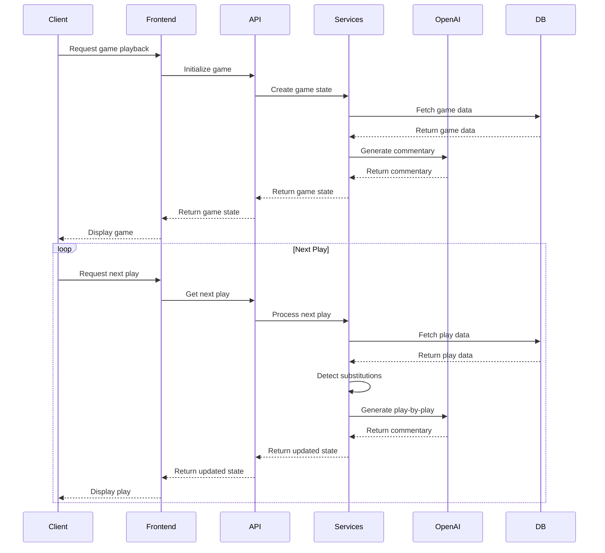
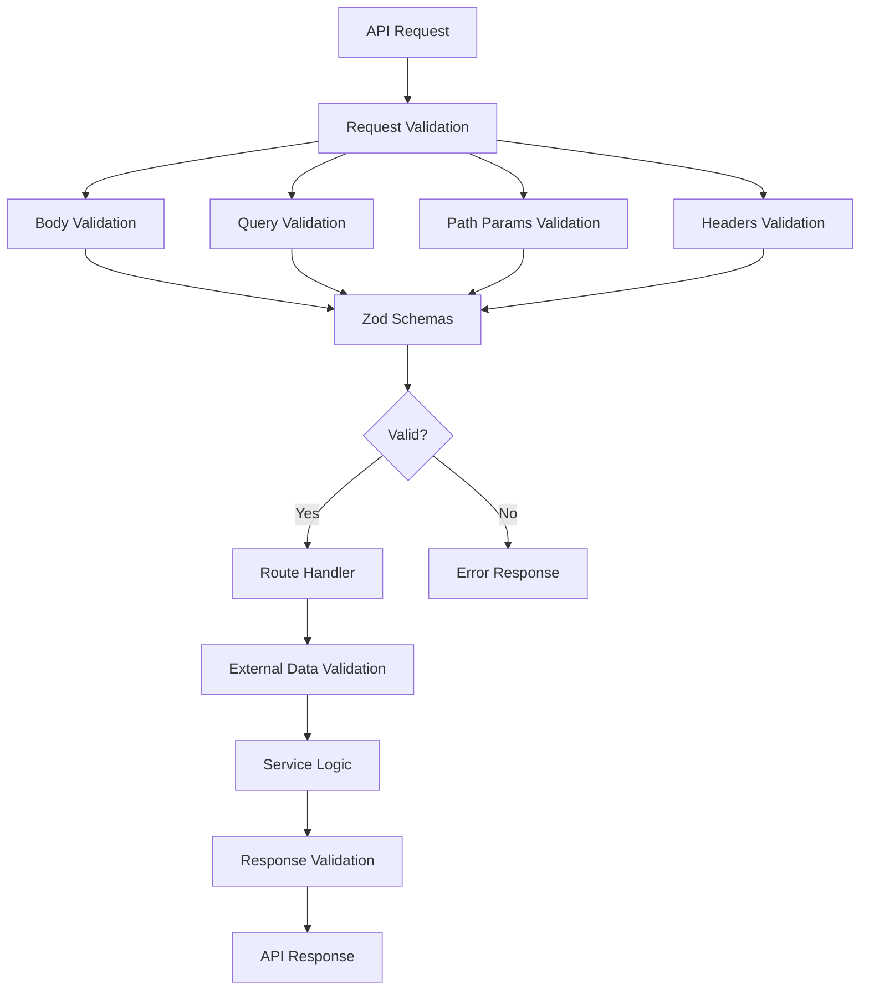
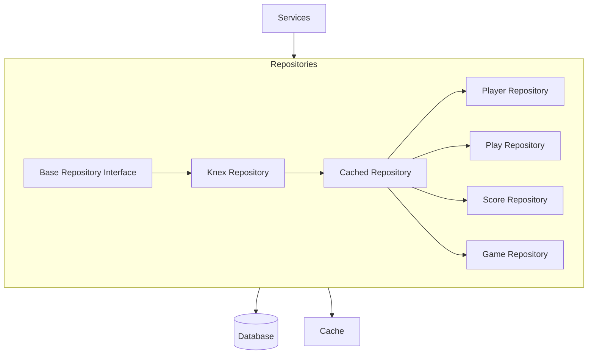
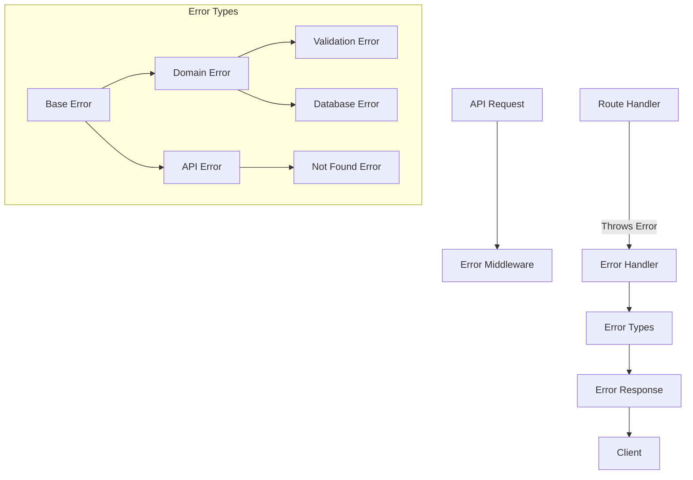

# Baseball Playback Application Architecture Diagrams

This document contains detailed architecture diagrams for the Baseball Playback application.

## System Architecture

```mermaid
graph TD
    Client[Client Browser] --> Frontend[React Frontend]
    Frontend --> API[Express API]
    API --> Services[Service Layer]
    Services --> Repositories[Repository Layer]
    Repositories --> DB[(MySQL Database)]
    Services --> OpenAI[OpenAI API]
    Services --> Cache[Cache Layer]
    Cache --> Memory[In-Memory Cache]
    
    subgraph Core Systems
        Validation[Validation System]
        ErrorHandling[Error Handling]
        Logging[Logging System]
        Performance[Performance Monitoring]
    end
    
    API --> Core Systems
    Services --> Core Systems
    
    subgraph Frontend Components
        BaseballGame[BaseballGame]
        Scoreboard[Scoreboard]
        LineupPanel[LineupPanel]
        TypedText[TypedText]
    end
    
    subgraph Backend Services
        GameService[Game Service]
        PlayerService[Player Service]
        LineupService[Lineup Service]
        CommentaryService[Commentary Service]
        PlayDataService[Play Data Service]
        BaseballStateService[Baseball State Service]
    end
    
    Frontend --> Frontend Components
    Services --> Backend Services
```

## Data Flow for Game Playback



## Lineup Tracking System

```mermaid
graph TD
    Game[Game] --> LineupState1[Initial Lineup State]
    LineupState1 --> LineupState2[Lineup State After Play 1]
    LineupState2 --> LineupState3[Lineup State After Play 2]
    LineupState3 --> LineupStateN[Lineup State After Play N]
    
    subgraph Lineup State
        Players[Players]
        Positions[Positions]
        BattingOrder[Batting Order]
        CurrentBatter[Current Batter]
        CurrentPitcher[Current Pitcher]
    end
    
    subgraph Lineup Changes
        Substitution[Substitution]
        PositionChange[Position Change]
        BattingOrderChange[Batting Order Change]
        PitchingChange[Pitching Change]
    end
    
    LineupState2 -- Detects --> Lineup Changes
    LineupState3 -- Detects --> Lineup Changes
    LineupStateN -- Detects --> Lineup Changes
```

## Validation System



## Repository Pattern



## Error Handling System



## Commentary Generation

```mermaid
graph TD
    PlayData[Play Data] --> CommentaryService[Commentary Service]
    BaseballState[Baseball State] --> CommentaryService
    
    CommentaryService --> PromptGenerator[Prompt Generator]
    PromptGenerator --> AIAdapter[AI Service Adapter]
    
    subgraph AI Adapters
        OpenAIAdapter[OpenAI Adapter]
        OtherAIAdapter[Other AI Adapter]
    end
    
    AIAdapter --> AIAdapterFactory[AI Adapter Factory]
    AIAdapterFactory --> OpenAIAdapter
    AIAdapterFactory --> OtherAIAdapter
    
    OpenAIAdapter --> OpenAIAPI[OpenAI API]
    OtherAIAdapter --> OtherAPI[Other AI API]
    
    OpenAIAPI --> Response[AI Response]
    OtherAPI --> Response
    
    Response --> CommentaryProcessing[Commentary Processing]
    CommentaryProcessing --> FinalCommentary[Final Commentary]