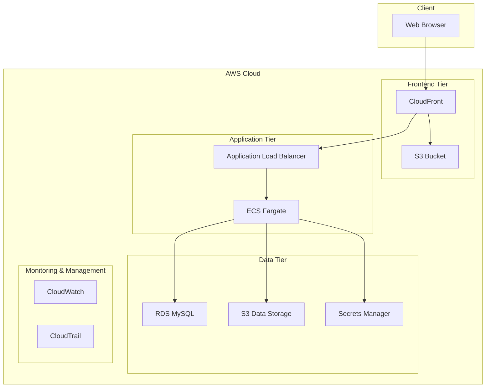
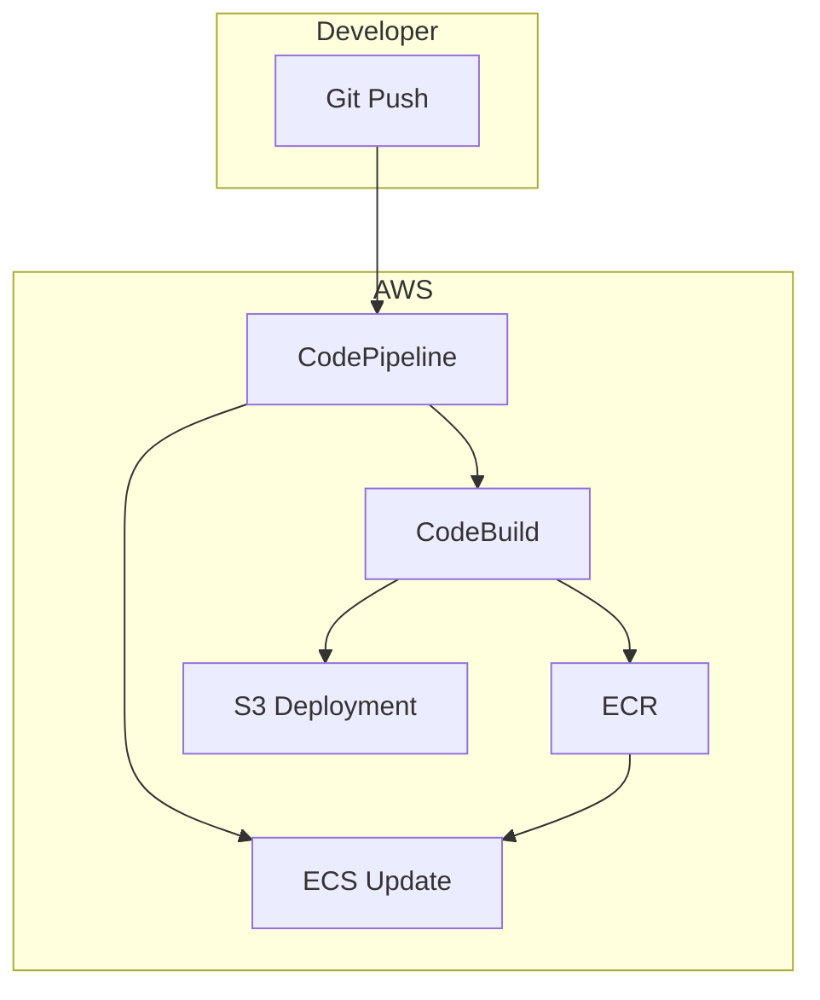

# AWS Deployment Plan for Baseball Playback Application

After analyzing the Baseball Playback application, I've created a detailed AWS deployment plan that starts small but can scale as needed. This plan considers the application's architecture, dependencies, and potential growth patterns.

## Architecture Overview

The application follows a modern three-tier architecture:



## Initial Deployment Components

### 1. Database Tier (RDS MySQL)

```
RDS MySQL (db.t3.small)
- Single AZ deployment initially
- Automated backups enabled
- Storage: 20GB with auto-scaling
- Parameter group customized for application needs
```

**Rationale**: The application uses MySQL for storing game data, OpenAI completions, and lineup information. A t3.small instance provides a good balance of performance and cost for low traffic.

### 2. Backend Tier (ECS Fargate)

```
ECS Fargate
- Task definition: 0.5 vCPU, 1GB memory
- Desired count: 2 (for high availability)
- Auto-scaling based on CPU utilization (target: 70%)
- Health check path: /api/health
```

**Rationale**: Fargate provides a serverless container environment that eliminates the need to manage EC2 instances. Starting with 2 tasks ensures high availability while keeping costs low.

### 3. Frontend Tier (S3 + CloudFront)

```
S3 Bucket
- Static website hosting enabled
- Versioning enabled
- Lifecycle rules to expire old versions after 30 days

CloudFront Distribution
- Origin: S3 bucket
- Cache behaviors optimized for React SPA
- HTTPS required
- Custom error responses for SPA routing
```

**Rationale**: S3 and CloudFront provide a cost-effective, scalable, and secure way to host the React frontend. CloudFront ensures low latency access globally.

### 4. API Gateway Layer

```
Application Load Balancer
- Target group: ECS service
- Health check path: /api/health
- HTTPS listener with AWS Certificate Manager certificate
- Security groups limiting access to necessary ports
```

**Rationale**: ALB provides a managed load balancing solution that can route traffic to the ECS tasks, handle health checks, and terminate SSL.

### 5. Security & Configuration

```
Secrets Manager
- Store database credentials
- Store OpenAI API key
- Store other sensitive configuration

IAM Roles
- ECS task execution role
- ECS task role with permissions to access S3, Secrets Manager
- CI/CD deployment roles
```

**Rationale**: Secrets Manager securely stores and manages sensitive information like API keys and database credentials. IAM roles follow the principle of least privilege.

## CI/CD Pipeline



**Implementation**:
1. AWS CodePipeline orchestrates the CI/CD workflow
2. AWS CodeBuild builds the Docker image for the backend and the static assets for the frontend
3. Backend image is pushed to ECR and deployed to ECS
4. Frontend assets are deployed to S3

## Environment Configuration

Create three environments with separate infrastructure:

1. **Development**
   - Lower-cost resources (e.g., t3.micro for RDS)
   - Automatic deployments from the development branch

2. **Staging**
   - Mirror of production environment but with smaller resources
   - Deployments triggered manually or automatically from the staging branch

3. **Production**
   - Full-scale resources as described in the components section
   - Deployments triggered manually after approval

## Cost Optimization

For the initial low-traffic deployment:

| Service | Configuration | Estimated Monthly Cost |
|---------|---------------|------------------------|
| RDS MySQL | db.t3.small, 20GB | $25-35 |
| ECS Fargate | 2 tasks, 0.5 vCPU, 1GB | $15-25 |
| S3 + CloudFront | 50GB transfer, 10GB storage | $5-10 |
| ALB | Single ALB | $16-20 |
| Secrets Manager | 5 secrets | $5 |
| CloudWatch | Basic monitoring | $5-10 |
| **Total** | | **$71-105** |

## Scaling Strategy

As the application grows, implement the following scaling strategies:

### 1. Database Tier
- Upgrade to Multi-AZ deployment for high availability
- Implement read replicas for read-heavy workloads
- Consider Aurora MySQL for better performance and scalability

### 2. Backend Tier
- Increase task count and CPU/memory allocation
- Implement auto-scaling based on request count and CPU utilization
- Consider splitting services (e.g., separate OpenAI integration service)

### 3. Frontend Tier
- Implement edge caching strategies
- Add regional deployments for global audience
- Optimize assets for faster loading

### 4. Caching Layer
- Add ElastiCache (Redis) for caching frequently accessed data
- Implement API response caching at CloudFront or API Gateway level

## Monitoring and Observability

```
CloudWatch
- Custom dashboard for application metrics
- Alarms for critical thresholds (CPU, memory, error rates)
- Log groups for application logs

X-Ray
- Trace requests through the application
- Identify performance bottlenecks
- Monitor dependencies
```

## Special Considerations for Baseball Playback

### 1. OpenAI API Integration
- Implement retry logic and circuit breakers for API calls
- Monitor token usage and costs
- Cache common responses to reduce API calls

### 2. Database Performance
- Optimize queries for the plays table which may grow large
- Create appropriate indexes for frequently queried fields
- Consider partitioning strategies for historical data

### 3. Game Data Storage
- Store Retrosheet data in S3 for cost-effective storage
- Implement a data pipeline to process and import new game data
- Consider using AWS Glue for ETL processes

## Deployment Steps

1. **Infrastructure Setup**
   - Create VPC with public and private subnets
   - Set up security groups and IAM roles
   - Deploy RDS instance with initial schema

2. **Backend Deployment**
   - Create ECR repository
   - Build and push Docker image
   - Configure ECS task definition and service
   - Set up ALB and target groups

3. **Frontend Deployment**
   - Create S3 bucket with appropriate permissions
   - Build and deploy React application
   - Configure CloudFront distribution

4. **Configuration and Secrets**
   - Store environment-specific configurations
   - Set up Secrets Manager for sensitive data
   - Configure environment variables for ECS tasks

5. **CI/CD Pipeline**
   - Set up CodePipeline for automated deployments
   - Configure build and test stages
   - Implement approval gates for production deployments

## Disaster Recovery Plan

1. **Database Backups**
   - Automated daily snapshots
   - Point-in-time recovery enabled
   - Test restoration process quarterly

2. **Infrastructure as Code**
   - Use AWS CloudFormation or Terraform to define infrastructure
   - Store templates in version control
   - Automate environment recreation

3. **Recovery Time Objective (RTO)**
   - Initial target: 4 hours
   - Scale down to 1 hour as application matures

4. **Recovery Point Objective (RPO)**
   - Initial target: 24 hours
   - Scale down to 1 hour with more frequent backups

## Future Enhancements

As the application grows, consider these AWS services to enhance functionality:

1. **AWS Lambda** for event-driven processing of game data
2. **Amazon Comprehend** or **SageMaker** for additional AI analysis of game commentary
3. **Amazon Cognito** for user authentication if adding user accounts
4. **AWS WAF** for additional security at the edge
5. **AWS Global Accelerator** for improved global performance

This deployment plan provides a solid foundation for the Baseball Playback application while allowing for cost-effective scaling as user demand increases. The serverless and managed services approach minimizes operational overhead while providing high availability and security.