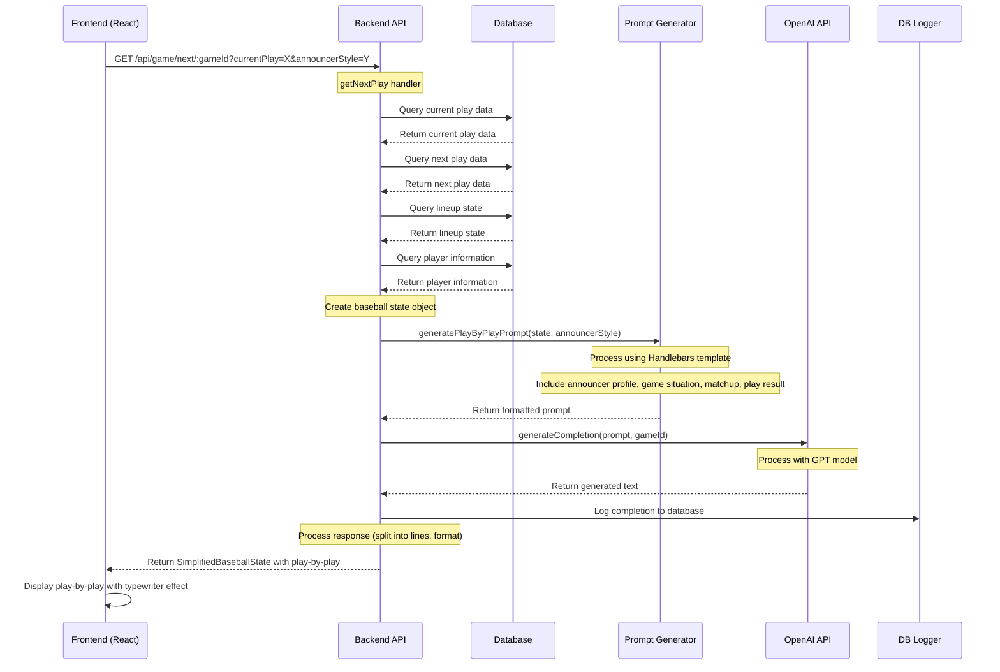

# Play-by-Play Prompt Generation Process

This document describes in detail how the play-by-play text prompts are generated and sent to OpenAI in the baseball playback application.

## Overview

The process involves several components working together:

1. The frontend requests the next play in a game sequence
2. The backend fetches game data from the database
3. A prompt is generated using Handlebars templates
4. The prompt is sent to OpenAI's API
5. The response is processed and returned to the frontend

## Data Flow Diagram



## Detailed Process Flow

### 1. Request Handling

When the frontend needs the next play in a game, it makes a request to the `/api/game/next/:gameId` endpoint with the current play ID. This request is handled by the `getNextPlay` function in `backend/src/routes/game/nextPlay.ts`.

```typescript
export const getNextPlay: RequestHandler = async (req, res) => {
    const gameId = req.params.gameId;
    const sessionId = req.headers['session-id'] as string;
    const currentPlay = parseInt(req.query.currentPlay as string);
    const skipLLM = req.query.skipLLM === 'true';
    
    // ... processing logic ...
}
```

### 2. Data Retrieval

The handler fetches the current play data and the next play data from the database:

```typescript
const { currentPlayData, nextPlayData } = await fetchPlayData(gameId, currentPlay);
```

This includes information about:
- Game situation (inning, outs, etc.)
- Teams and players
- Play events and descriptions

### 3. State Construction

The handler constructs a baseball state object with all the necessary information:

```typescript
let currentState = createInitialBaseballState(gameId, sessionId, currentPlay, currentPlayData);
currentState = await processLineupState(gameId, sessionId, currentPlay, currentState, currentPlayData, nextPlayData);
```

This state includes:
- Game information (inning, outs, runners on base)
- Team information (names, lineups)
- Player information (batters, pitchers)

### 4. Prompt Generation

#### For Next Play Commentary

For regular play-by-play, the application uses the `generateNextPlayPrompt` function in `backend/src/services/prompts/nextPlay.ts`:

```typescript
const logEntries = await generatePlayCompletion(currentState, nextPlayData, currentPlay, skipLLM, gameId);
```

The `generatePlayCompletion` function calls `generateNextPlayPrompt` and then sends the prompt to OpenAI:

```typescript
const prompt = generateNextPlayPrompt(currentState, nextPlay, currentPlay);
const completionText = skipLLM
    ? "This is a dummy response for testing purposes. LLM calls are being skipped."
    : await generateCompletion(prompt, gameId);
```

The `generateNextPlayPrompt` function uses a Handlebars template to create the prompt:

```typescript
export const nextPlayTemplate = Handlebars.compile(`
Game state: {{inningDisplay inning}} inning, {{#if isTopInning}}top{{else}}bottom{{/if}} half with {{outs}} out(s).
{{#if onFirst}}Runner on first: {{onFirst}}. {{/if}}
{{#if onSecond}}Runner on second: {{onSecond}}. {{/if}}
{{#if onThird}}Runner on third: {{onThird}}. {{/if}}

{{batterTeam}} batting with {{batter.firstName}} {{batter.lastName}} at the plate against {{pitcher.firstName}} {{pitcher.lastName}}.

Current play: {{currentPlay}}
Next play details:
{{playDetails}}

Describe this play in a natural, engaging baseball announcer style. Include relevant details about the current game situation, the players involved, and the outcome of the play.
`);
```

#### For Detailed Play-by-Play Commentary

For more detailed play-by-play commentary, the application uses the `generatePlayByPlayPrompt` function in `backend/src/services/prompts/playByPlay.ts`. This function creates a more elaborate prompt that includes:

1. Announcer profile information:
```typescript
const extendedState: ExtendedBaseballState = {
  announcer: DEFAULT_ANNOUNCERS[announcerType],
  // ... other state properties ...
};
```

2. A detailed template with specific instructions for the AI:
```typescript
const promptTemplate = Handlebars.compile(`
You are an experienced baseball announcer providing play-by-play commentary for a baseball game. Use the following game state information to create an engaging, natural-sounding description of the current play in the style of the specified announcer.

# Announcer
- Name: {{announcer.name}}
- Style: {{announcer.style}}
- Catchphrases: {{#each announcer.catchphrases}}{{this}}{{#unless @last}}, {{/unless}}{{/each}}
- Era: {{announcer.era}}

# Game Situation
- Inning: {{game.inning}}, {{#if game.isTopInning}}Top{{else}}Bottom{{/if}} half
- Outs: {{game.outs}}
- Runners: {{#if game.onFirst}}Runner on first ({{game.onFirst}}){{/if}}{{#if game.onSecond}}{{#if game.onFirst}}, {{/if}}Runner on second ({{game.onSecond}}){{/if}}{{#if game.onThird}}{{#if game.onFirst}}{{#if game.onSecond}}, {{else}}, {{/if}}{{else}}{{#if game.onSecond}}, {{/if}}{{/if}}Runner on third ({{game.onThird}}){{/if}}{{#unless game.onFirst}}{{#unless game.onSecond}}{{#unless game.onThird}}Bases empty{{/unless}}{{/unless}}{{/unless}}
- Score: {{home.displayName}} {{home.runs}}, {{visitors.displayName}} {{visitors.runs}}

# Current Matchup
- At bat: {{#if game.isTopInning}}{{visitors.currentBatter}} ({{visitors.displayName}}){{else}}{{home.currentBatter}} ({{home.displayName}}){{/if}}
- Pitching: {{#if game.isTopInning}}{{home.currentPitcher}} ({{home.displayName}}){{else}}{{visitors.currentPitcher}} ({{visitors.displayName}}){{/if}}

# Play Result
- Play description: {{playDescription}}
- Event code: {{eventString}}

Provide a play-by-play commentary that authentically captures the specified announcer's unique style, catchphrases, and era. Start immediately with describing the current situation (inning, score, outs, runners) and then the action of the play. Do not include any introductory text or phrases like "Here's the play-by-play" or "Let me describe what happened."

Mention the players involved by name and the outcome. Use varied language and authentic baseball terminology that would be appropriate for the announcer's era. Do not simply repeat the play description verbatim. Elaborate on what happened, add color commentary, and make it sound like a real baseball broadcast. Consider the context of the game situation when describing the play. If appropriate for the announcer, incorporate one of their catchphrases naturally into the commentary.
`);
```

### 5. OpenAI API Integration

The prompt is sent to OpenAI using the `generateCompletion` function in `backend/src/services/openai.ts`:

```typescript
export async function generateCompletion(
  prompt: string, 
  gameId: string = "-1"
): Promise<string> {
  // ... implementation ...
}
```

This function:
1. Determines which OpenAI API to use based on the model (chat completions for GPT-4/3.5, completions for older models)
2. Sends the prompt to OpenAI with appropriate parameters (temperature, max tokens, etc.)
3. Logs the completion to the database with metrics (latency, token usage, etc.)
4. Returns the generated text

For chat completions (GPT-4 and GPT-3.5-turbo models):
```typescript
response = await openai.chat.completions.create({
  model: config.openai.model,
  messages: [
    {
      role: 'system',
      content: 'You are a baseball announcer describing plays in the style of Vin Scully.'
    },
    {
      role: 'user',
      content: prompt
    }
  ],
  max_tokens: config.openai.maxTokens,
  temperature: config.openai.temperature,
});
```

For completions (older models):
```typescript
response = await openai.completions.create({
  model: config.openai.model,
  prompt,
  max_tokens: config.openai.maxTokens,
  temperature: config.openai.temperature,
});
```

### 6. Response Processing

The response from OpenAI is processed and returned to the frontend:

```typescript
return completionText
  .replace(/([.!?])\s+/g, '$1\n')
  .split('\n')
  .filter(line => line.trim() !== '')
  .map(line => line.trim());
```

This processing:
1. Splits the text into lines at sentence boundaries
2. Removes empty lines
3. Trims whitespace from each line

## Announcer Styles

The application supports different announcer styles for play-by-play commentary:

```typescript
const DEFAULT_ANNOUNCERS: Record<string, AnnouncerProfile> = {
  'classic': {
    name: 'Bob Costas',
    style: 'Professional, precise, knowledgeable, balanced',
    catchphrases: [
      'How about that!', 
      'He\'s done it again!', 
      'That\'s one for the highlight reel'
    ],
    era: '1980s-2010s'
  },
  'modern': {
    name: 'Joe Buck',
    style: 'Energetic, concise, dramatic, modern',
    catchphrases: [
      'Back at the wall...', 
      'We will see you tomorrow night!', 
      'Unbelievable!'
    ],
    era: '1990s-Present'
  },
  'enthusiastic': {
    name: 'Harry Caray',
    style: 'Enthusiastic, folksy, passionate, fan-like',
    catchphrases: [
      'Holy Cow!', 
      'It might be, it could be, it IS! A home run!', 
      'Cubs win! Cubs win!'
    ],
    era: '1940s-1990s'
  },
  'poetic': {
    name: 'Vin Scully',
    style: 'Eloquent, poetic, storytelling, detailed, conversational',
    catchphrases: [
      'Pull up a chair and spend the afternoon', 
      'In a year that has been so improbable, the impossible has happened!', 
      'It\'s time for Dodger baseball!'
    ],
    era: '1950s-2010s'
  }
};
```

## Transitioning from Current Prompt to More Detailed Play-by-Play Prompt

### Implementation Steps

#### 1. Update the `getNextPlay` Route Handler

The main change would be in the `getNextPlay` handler in `backend/src/routes/game/nextPlay.ts`:

```typescript
// Current implementation
const logEntries = await generatePlayCompletion(currentState, nextPlayData, currentPlay, skipLLM, gameId);

// Modified implementation to use the detailed prompt
const logEntries = await generateDetailedPlayCompletion(currentState, nextPlayData, currentPlay, skipLLM, gameId, announcerStyle);
```

#### 2. Create a New Function for Detailed Play Completion

Add a new function similar to `generatePlayCompletion` but using the detailed prompt:

```typescript
const generateDetailedPlayCompletion = async (
    currentState: BaseballState,
    nextPlay: PlayData,
    currentPlay: number,
    skipLLM: boolean,
    gameId: string,
    announcerStyle: string = 'classic' // Default announcer style
): Promise<string[]> => {
    // Create a simplified baseball state from the current state
    const simplifiedState: SimplifiedBaseballState = {
        gameId: currentState.gameId,
        sessionId: currentState.sessionId,
        game: {
            inning: currentState.game.inning,
            isTopInning: currentState.game.isTopInning,
            outs: currentState.game.outs,
            log: currentState.game.log,
            onFirst: currentState.game.onFirst,
            onSecond: currentState.game.onSecond,
            onThird: currentState.game.onThird
        },
        home: {
            id: currentState.home.id,
            displayName: currentState.home.displayName,
            shortName: currentState.home.shortName,
            currentBatter: currentState.home.currentBatter,
            currentPitcher: currentState.home.currentPitcher,
            nextBatter: currentState.home.nextBatter,
            nextPitcher: currentState.home.nextPitcher,
            runs: currentState.home.runs || 0
        },
        visitors: {
            id: currentState.visitors.id,
            displayName: currentState.visitors.displayName,
            shortName: currentState.visitors.shortName,
            currentBatter: currentState.visitors.currentBatter,
            currentPitcher: currentState.visitors.currentPitcher,
            nextBatter: currentState.visitors.nextBatter,
            nextPitcher: currentState.visitors.nextPitcher,
            runs: currentState.visitors.runs || 0
        },
        currentPlay: currentPlay,
        playDescription: translateEvent(nextPlay.event || ''),
        eventString: nextPlay.event
    };
    
    // Generate the detailed prompt
    const prompt = generatePlayByPlayPrompt(simplifiedState, announcerStyle);
    
    const completionText = skipLLM
        ? "This is a dummy response for testing purposes. LLM calls are being skipped."
        : await generateCompletion(prompt, gameId);
    
    return completionText
        .replace(/([.!?])\s+/g, '$1\n')
        .split('\n')
        .filter(line => line.trim() !== '')
        .map(line => line.trim());
};
```

#### 3. Add Announcer Style Selection

Add a way for the client to specify the announcer style:

```typescript
// In the route handler
const announcerStyle = req.query.announcerStyle as string || 'classic';
```

#### 4. Update the OpenAI Service

The current `openai.ts` service has a hardcoded system message:

```typescript
{
  role: 'system',
  content: 'You are a baseball announcer describing plays in the style of Vin Scully.'
}
```

This should be updated to be dynamic based on the announcer style:

```typescript
const getSystemMessageForAnnouncer = (announcerStyle: string): string => {
  const announcers = {
    'classic': 'Bob Costas',
    'modern': 'Joe Buck',
    'enthusiastic': 'Harry Caray',
    'poetic': 'Vin Scully'
  };
  
  const announcer = announcers[announcerStyle] || 'Vin Scully';
  return `You are a baseball announcer describing plays in the style of ${announcer}.`;
};

// Then in the generateCompletion function:
response = await openai.chat.completions.create({
  model: config.openai.model,
  messages: [
    {
      role: 'system',
      content: getSystemMessageForAnnouncer(announcerStyle)
    },
    {
      role: 'user',
      content: prompt
    }
  ],
  max_tokens: config.openai.maxTokens,
  temperature: config.openai.temperature,
});
```

#### 5. Update the API Documentation

Update the API documentation to reflect the new parameter:

```typescript
// In backend/src/routes/API.md or similar
/**
 * @api {get} /api/game/next/:gameId Get next play
 * @apiParam {String} gameId Game ID
 * @apiParam {Number} currentPlay Current play index
 * @apiParam {Boolean} [skipLLM=false] Skip LLM generation (for testing)
 * @apiParam {String} [announcerStyle=classic] Announcer style (classic, modern, enthusiastic, poetic)
 */
```

#### 6. Update the Frontend

Update the frontend to allow users to select the announcer style:

```typescript
// In frontend/src/components/BaseballGame.tsx or similar
const [announcerStyle, setAnnouncerStyle] = useState('classic');

// Add a dropdown to select the announcer style
<select value={announcerStyle} onChange={(e) => setAnnouncerStyle(e.target.value)}>
  <option value="classic">Classic (Bob Costas)</option>
  <option value="modern">Modern (Joe Buck)</option>
  <option value="enthusiastic">Enthusiastic (Harry Caray)</option>
  <option value="poetic">Poetic (Vin Scully)</option>
</select>

// Update the API call to include the announcer style
const fetchNextPlay = async () => {
  const response = await fetch(`/api/game/next/${gameId}?currentPlay=${currentPlay}&announcerStyle=${announcerStyle}`);
  // ...
};
```

### Additional Considerations

#### 1. Score Information

The detailed prompt includes score information, which needs to be properly tracked and included in the state:

```typescript
// In the getNextPlay handler
const homeScoreAfterPlay = /* calculate home score */;
const visitorScoreAfterPlay = /* calculate visitor score */;

// Include in the simplified state
home: {
  // ...
  runs: homeScoreAfterPlay
},
visitors: {
  // ...
  runs: visitorScoreAfterPlay
}
```

#### 2. Performance Impact

The detailed prompt is significantly larger than the current prompt, which could impact:
- Token usage (and therefore cost)
- Response time
- Database storage for logging completions

Consider adding monitoring to track these metrics.

#### 3. Testing

Create test cases to verify the quality of the generated commentary with different announcer styles:

```typescript
// In a test file
const testAnnouncerStyles = async () => {
  const styles = ['classic', 'modern', 'enthusiastic', 'poetic'];
  const mockState = /* create mock state */;
  
  for (const style of styles) {
    const prompt = generatePlayByPlayPrompt(mockState, style);
    console.log(`=== ${style.toUpperCase()} ===`);
    console.log(prompt);
    
    // Optionally test with actual OpenAI calls
    // const completion = await generateCompletion(prompt, 'test-game');
    // console.log(completion);
  }
};
```

## Summary

The play-by-play prompt generation process is a sophisticated system that:

1. Retrieves game data from the database
2. Constructs a detailed state object with game, team, and player information
3. Uses Handlebars templates to generate prompts with specific instructions for OpenAI
4. Supports different announcer styles with unique characteristics
5. Sends the prompts to OpenAI's API with appropriate parameters
6. Processes and returns the generated text to the frontend

This approach allows the application to generate natural, engaging play-by-play commentary that mimics the style of real baseball announcers.